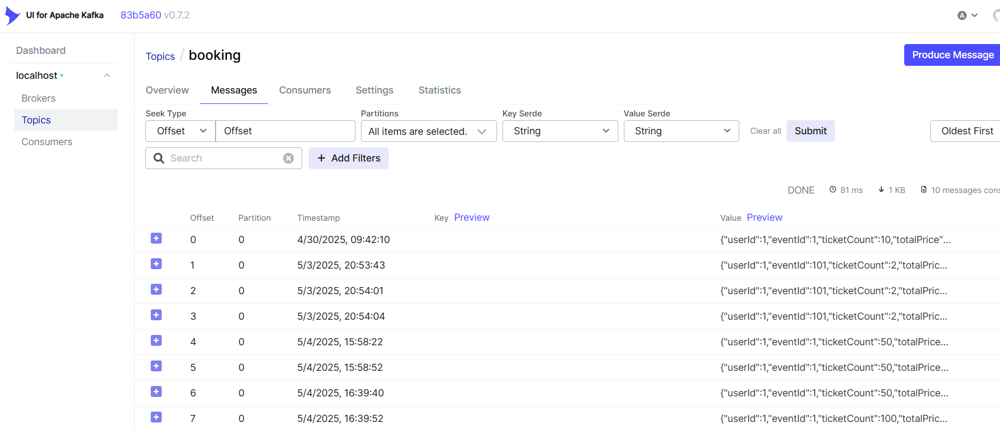
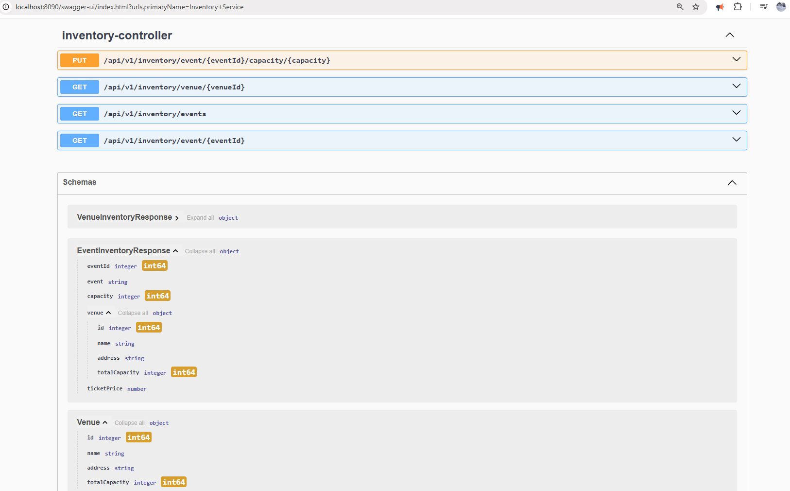
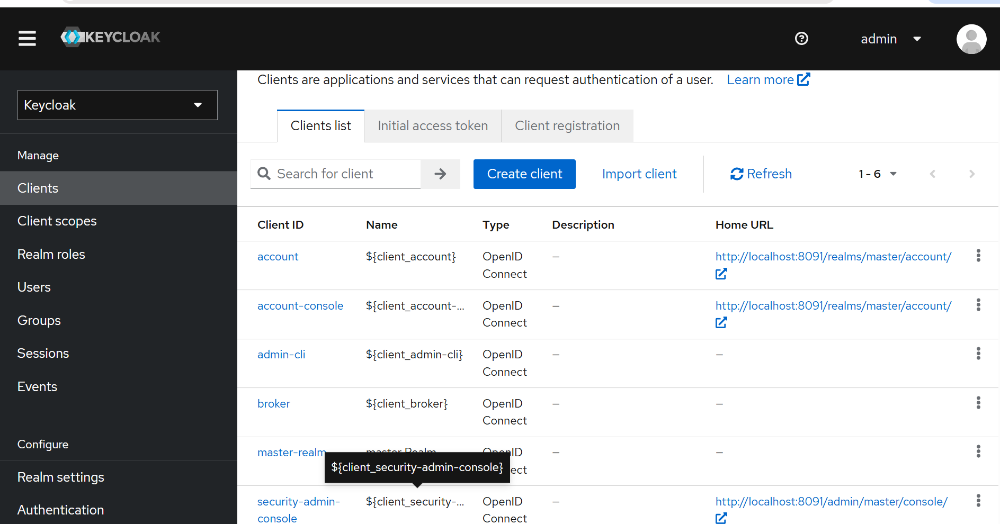
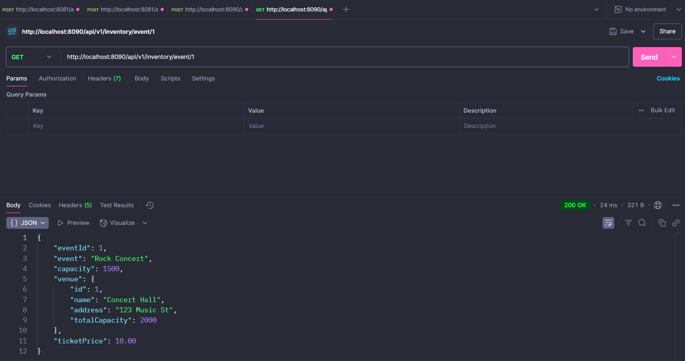
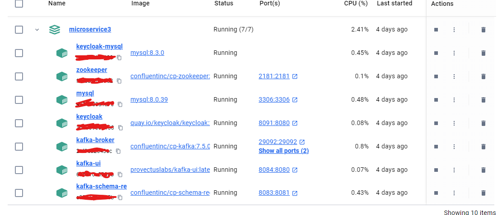
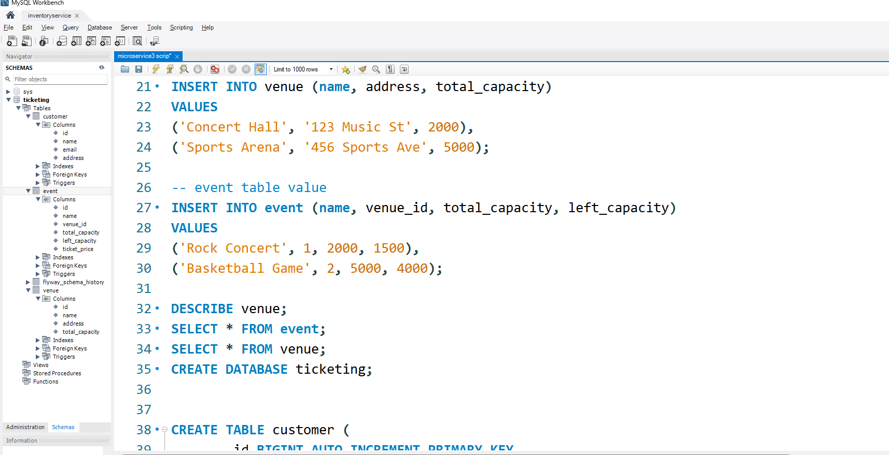

# **Microservice3**

### **INVENTORY SERVICE**

**Steps:**

1. Go to [start.spring.io](https://start.spring.io)

   * Project: Maven
   * Spring Boot: 3.4.2
   * Packaging: Jar
   * Java: 21
   * Name: `inventoryservice`
   * Group: `kevinll`
   * Dependencies: Spring Web, Lombok, Spring Data JPA, MySQL Driver, Flyway Migration

2. Open the project in IntelliJ.
   Create a package `controller` and file `InventoryController`.

3. Create a package `response` and file `EventInventoryResponse`.

4. Create a package `service` and file `InventoryService`.
   Ensure `EventRepository` and `VenueRepository` are implemented for DB access.

5. Create a package `repository` and interfaces:

   * `EventRepository`
   * `VenueRepository`

6. Create a package `entity`, add class `Venue`.
   Add `@Getter`, `@Setter`, and annotate the table name.

7. In the `entity` folder, create `Event` class.

8. In the `response` package, add class `VenueInventoryResponse`.

9. Create `docker-compose.yml` in root for MySQL.
   Then, under root create folder `docker/mysql/init.sql`.

10. Ensure DB credentials are in `application.properties`.

11. Under `resources`, create folder `db.migration`, and add Flyway script `V1__init.sql`.

12. Populate MySQL `flyway_schema` with sample `event` and `venue` data.
    Example: `("Cars", 1, 20000, 20000);`

13. Run the application by creating a run config with `InventoryserviceApplication.java`.

14. Test APIs with Postman:

    * GET `http://localhost:8080/api/v1/inventory/venue/1`
    * GET `http://localhost:8080/api/v1/inventory/events`

---

### **BOOKING SERVICE**

15. Go to [start.spring.io](https://start.spring.io)

    * Group: `kevinll`
    * Artifact: `bookingservice`
    * Same setup
    * Dependencies: Spring Web, Lombok, Spring Data JPA, MySQL Driver, Spring for Apache Kafka

16. Open in IntelliJ. Create folder `controller` and file `BookingController`.

17. Create folder `service`, add file `BookingService`.

18. Create folder `request`, add file `BookingRequest` (DTO-like).

19. Create folder `response`, add file `BookingResponse` (DTO-like).

20. In `inventoryservice/db.migration`, add:

    * `V2_add_ticket.sql`
    * `V3_create_customer_table.sql`
    * `V4_create_order_table.sql`

21. If errors:
    Run:

    ```sql
    SET SQL_SAFE_UPDATES = 0;
    DELETE FROM ticketing.flyway_schema_history WHERE version = 4;
    ```

22. In `bookingservice`, create `repository` and interface `CustomerRepository`.

23. Create package `entity`, add class `Customer`.

24. Create package `client`, add class `InventoryServiceClient`.

25. In `response`, create `InventoryResponse`:
    Include fields like `eventId`, `event`, `capacity`, `venue: VenueResponse`.

26. In `response`, create class `VenueResponse`.

27. Set `application.properties` with port `8081`.
    Add run config: `bookingservice`.

28. Run Docker, `inventoryservice`, and `bookingservice`.

---

### **KAFKA**

29. In `inventoryservice`, extend `docker-compose.yml` with:

    * `zookeeper:`
    * `kafka-broker:`
    * `kafka-ui:`
    * `kafka-schema-registry:`
      Run:

    ```
    docker compose down
    docker compose up -d
    ```

30. In `bookingservice`, create `event` package and class `BookingEvent`.

31. In `BookingService.java`, add Kafka setup and method `createBookingEvent` with `kafkaTemplate.send()`.

32. In `application.properties`, add Kafka port `9092`.
    Verify in Docker.

33. In Postman, test POST:
    `http://localhost:8081/api/v1/booking`
    Ensure 200 OK to trigger topic.

34. Go to `localhost:8084` (Kafka UI).
    Use:

    * Cluster: `localhost`
    * Bootstrap server: `kafka-broker:29092`

---

### **ORDER SERVICE**

35. Go to [start.spring.io](https://start.spring.io)

    * Artifact: `orderservice`
    * Same config and dependencies

36. In `orderservice`, create `service` with class `OrderService`.

37. Add package `example.kevinll.bookingservice`, with class `BookingEvent`.

38. Create `entity` package, class `Order`.

39. Create `repository` package, interface `OrderRepository`.

40. In `inventoryservice`, add `@PutMapping` in `InventoryController` for capacity update.

41. In `orderservice`, create `client` package with `InventoryServiceClient`.

42. Ensure `application.properties` is configured with DB/Kafka ports.

43. Match path for `BookingEvent`, add `@KafkaListener` in `OrderService`.

44. Run all services and test with Postman:

    * GET: `http://localhost:8080/api/v1/inventory/event/1`
    * POST: `http://localhost:8081/api/v1/booking`
    * SQL: `SELECT * FROM ticketing.order;`

---

### **API GATEWAY**

45. Go to [start.spring.io](https://start.spring.io)

    * Artifact: `apigateway`
    * Add dependency: Gateway

46. In IntelliJ, create package `route`:

    * `InventoryServiceRoutes`
    * `BookingServiceRoutes`

47. In `application.properties`, set port `8090`.

48. Run all services including `apigateway`.
    Test with Postman:

    * POST `http://localhost:8090/api/v1/booking`

      ```json
      { "userId": 1, "eventId": 1, "tocketCount": 50 }
      ```
    * GET `http://localhost:8090/api/v1/inventory/event/1`

---

### **SPRING SECURITY WITH KEYCLOAK**

49. In `inventoryservice/docker-compose.yml`, add `keycloak-db:` and `keycloak:`
    Use unused port (e.g., 8091)

50. Run:

    ```
    docker compose up -d
    ```

    Visit `localhost:8091`, login with `admin/admin`
    Create a Realm (e.g., `ticketing-security-realm`)

51. Set up Keycloak clients under the created realm.

52. In `apigateway`, add dependency:

    ```xml
    <artifactId>spring-boot-starter-oauth2-resource-server</artifactId>
    ```

53. Create package `config`, class `SecurityConfig`.

54. In `application.properties`, configure Keycloak.
    Test authorization on:

    * `http://localhost:8090/api/v1/booking`
    * `http://localhost:8090/api/v1/inventory/event/1`

### ⚠️ Technical Challenges

#### 1. Microservice Coordination  
Running multiple Spring Boot apps alongside Kafka, MySQL, and Keycloak in Docker Compose requires careful orchestration and port management.

#### 2. Flyway Migration Conflicts  
Schema versioning across services can lead to `flyway_schema_history` conflicts, especially during parallel development or rollback scenarios.

#### 3. Inter-Service Communication  
Implementing reliable Kafka event publishing/consumption and REST client calls (e.g., `InventoryServiceClient`) introduces serialization and network concerns.

#### 4. Security Integration  
Configuring Keycloak with Spring Security and OAuth2 Resource Server in the API Gateway involves precise token validation and role mapping.








